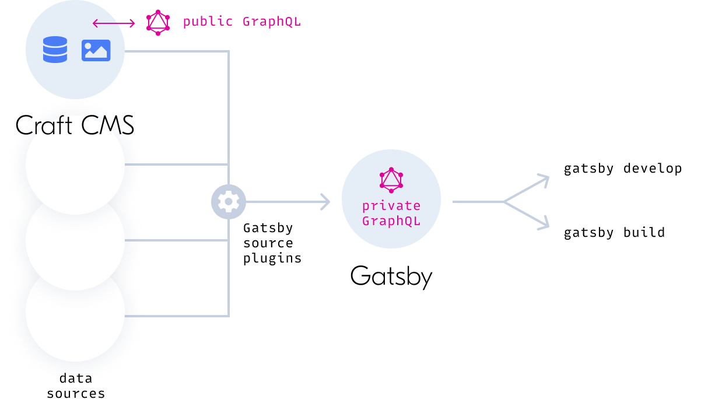

<p align="center">
  
</p>
<h1 align="center">Gatsby source plugin for Craft CMS</h1>

This Gatsby source plugin provides an integration with [Craft CMS](https://craftcms.com). It uses Craft’s [GraphQL API](https://docs.craftcms.com/v3/graphql.html) to make content within Craft available to Gatsby-powered front ends.

It requires Craft CMS 3.5.16 or later, and for the corresponding [Gatsby Helper](https://github.com/craftcms/gatsby-helper) plugin to be installed on the Craft site.

---

## Table of Contents

- [Requirements](#requirements)
- [Quick Start](#quick-start)
  - [Configure the Craft Helper Plugin](#configure-the-craft-helper-plugin)
  - [Install and Configure the Gatsby Source Plugin](#install-and-configure-the-gatsby-source-plugin)
- [Overview](#overview)
- [Usage](#usage)
  - [Configuration Options](#configuration-options)
  - [Fetching Craft Content](#fetching-craft-content)
  - [Enabling Loose Interfaces](#enabling-loose-interfaces)
  - [Using Sourcing Parameters](#using-sourcing-parameters)
  - [Sourcing Multiple Sites](#sourcing-multiple-sites)
  - [Live Preview](#live-preview)
  - [Building the Site](#building-the-site)
- [Differences from Other Source Plugins](#differences-from-other-source-plugins)
  - [gatsby-source-graphql](#gatsby-source-graphql)
  - [gatsby-source-craftcms](#gatsby-source-craftcms)
- [Integrating Third-Party Content](#integrating-third-party-content)
- [Troubleshooting](#troubleshooting)
- [Resources](#resources)
---

## Requirements

- Craft CMS instance running with the [Gatsby Helper](https://github.com/craftcms/gatsby-helper) plugin installed and configured.
- Gatsby project you can work with locally.

## Quick Start

### Configure the Craft Helper Plugin

On the Craft CMS end, you’ll need the following:

- Content in your Craft project that can be queried.
- A configured GraphQL endpoint for Craft.
- A GraphQL schema that has the Gatsby component enabled.

If you’ve never built a Craft site, the best place to start is the [Intro to Craft CMS Tutorial](https://craftcms.com/docs/getting-started-tutorial/).

For configuring Craft’s GraphQL endpoint, schema, and tokens, see Craft’s [GraphQL documentation](https://craftcms.com/docs/3.x/graphql.html#getting-started).

Once your endpoint and schema are established, be sure to enable **Allow discovery of sourcing data for Gatsby** in the **Gatsby** section of the schema you’d like to query with the [gatsby-source-craft](https://github.com/craftcms/gatsby-source-craft) Gatsby plugin.

You may optionally designate a **Preview webhook target URL** in the plugin settings.

### Install and Configure the Gatsby Source Plugin

#### 1. Install the Source Plugin

Install the Gatsby source plugin by running the following command in your terminal:

```
npm install --save-dev gatsby-source-craft
```

#### 2. Configure the Source Plugin

At minimum, you’ll need to add or edit your Gatsby project’s `.env` file with environment variables that specify your Craft CMS GraphQL endpoint and token:

```title:.env
CRAFTGQL_TOKEN=your-graphql-token
CRAFTGQL_URL=https://your-craftcms-site.test/api
```

You’ll also need to add the Gatsby source plugin in [your `gatsby-config.js` file’s `plugins` array](https://www.gatsbyjs.com/docs/configuring-usage-with-plugin-options/#where-to-access-plugin-options):

```title:gatsby-config.js
  // ...
  plugins: [
    `gatsby-source-craft`
  ]
  // ...
```

You may optionally override any of the default [configuration options](#configuration-options) there as well:

```title:gatsby-config.js
  // ...
  plugins: [
    {
      resolve: `gatsby-source-craft`,
      options: {
        concurrency: 12,
        typePrefix: `CraftGQL_`
      }
  ]
  // ...
```

#### 3. Confirm Success

Run `gatsby develop` and you should be able to watch Gatsby source the entire Craft CMS schema. When it’s finished, you should be able to query your Craft content running http://localhost:8000/___graphql.

Now you’re ready to [query Craft CMS content](#fetching-craft-content) and build a blazing-fast Gatsby front end!

## Overview

Craft’s flexible content schema is accessible to front ends via [Element Queries](https://craftcms.com/docs/3.x/element-queries.html) and a similar public GraphQL API. This Gatsby source plugin, combined with its companion Craft CMS plugin, translates your Craft project schema specifically for Gatsby’s internal GraphQL API.



Gatsby uses source plugins like this to collect content from any number of sources (local markdown, REST and GraphQL APIs, etc.) and combine them in a single, consistent GraphQL API that can be used to build a [React](https://reactjs.org/)-based front end.

If you’re a hands-on learner, the quickest way to appreciate the difference between these GraphQL APIs is to see each in action. Open GraphiQL from the Craft control panel and run `gatsby develop` before visiting http://localhost:8000/___graphql. Gatsby’s GraphQL API is the one you’ll query when building your Gatsby site.

If you’re a learn-by-reading type that’s new to Craft CMS, you may first want to look at Craft’s [GraphQL API](https://craftcms.com/docs/3.x/graphql.html) see how you’d fetch content directly. It’ll probably help make sense of the schema available to Gatsby. If you’re new to Gatsby, the [Gatsby Tutorials](https://www.gatsbyjs.com/tutorial/) offer an excellent start with the basics.

> 💡 Tip: take a look at the [Craft CMS Blog Starter](https://github.com/craftcms/starter-blog) if you’d like to see an example Craft+Gatsby integration that uses this source plugin.

## Usage

### Configuration Options

| Option            | Default                          | Description |
| ----------------- | -------------------------------- | ----------- |
| `concurrency`     | `10`                             | Number of concurrent connections to use querying Craft.
| `debugDir`        | `.cache/craft-graphql-documents` | Directory for storing generated GraphQL documents for debugging.
| `fragmentsDir`    | `.cache/craft-fragments`         | Directory for storing GraphQL fragments.
| `typePrefix`      | `Craft_`                         | Craft schema type prefix. (Underscore is optional; see examples below.)
| `looseInterfaces` | `false`                          | Whether to allow filtering all Craft types by all available interfaces. (See [Enabling Loose Interfaces](#enabling-loose-interfaces).)
| `sourcingParams`  | `{}`                             | Parameters to be included by type when sourcing content. (See [Using Sourcing Parameters](#using-sourcing-parameters))
| `enabledSites`    | `null`                           | Defaults to primary site, but may be set to an array of site handles. (See [Sourcing Multiple Sites](#sourcing-multiple-sites).)

### Fetching Craft Content

Once your Craft CMS content schema has been sourced and translated into Gatsby data nodes, you’ll query those nodes from your Gatsby components.

If you’re new to Gatsby, this is a vital and potentially confusing distinction: **you’ll query Gatsby’s GraphQL API in your React components, and that’s different from Craft’s GraphQL API.**

The examples that follow assume you’re using the default `Craft_` type prefix. If you’ve specified a different one, like `Foo_` for example, the types in your queries would change slightly.

| `typePrefix: 'Craft_'`  | `typePrefix: 'Foo_'`  |
| ----------------------- | --------------------- |
| `Craft_blog_blog_Entry` | `Foo_blog_blog_Entry` |
| `allCraftBlogBlogEntry` | `allFooBlogBlogEntry` |
| `craftBlogBlogEntry`    | `fooBlogBlogEntry`    |

You’ll be able to query content to get either a single object or several of them that are returned in a `nodes` array. You can narrow the kind of content you’d like in two different ways:

1. As a specific element type, like a blog section and entry type.
2. As a generic content type, meaning content that may exist across *different* sections and entry types.

**Specific element types** will be accessible via `allCraft<camelCasedGraphQLType>` and `craft<camelCasedGraphQLType>`. For example, a `Blog` section and entry type would be available as `allCraftBlogBlogEntry` and `craftBlogBlogEntry`. Whether you’re dealing with one object or several, you won’t need to further specify each node’s type to query its custom content fields.

```graphql
# multiple blog post entry titles + custom field values
{
  allCraftBlogBlogEntry {
    nodes {
      title
      myCustomBlogField
    }
  }
}
# single blog post entry title + custom field values
{
  craftBlogBlogEntry {
    title
    myCustomBlogField
  }
}
```

> 💡 **Why `BlogBlog` instead of `Blog`?**\
The first `Blog` refers to the Craft section type while the second refers to the [entry type](https://craftcms.com/docs/3.x/entries.html#entry-types). Often there’s just a single entry type per section, but there *can* be many of them!

**Generic content types** will be accessible via `allCraft<interfaceName>` and `craft<interfaceName>`. You’ll likely have, for example, `allCraftEntryInterface` and `craftEntryInterface`. These can fetch GraphQL objects that implement the Entry interface. In other words, entries that may exist in different sections and entry types.

```graphql
# multiple entry titles with custom *blog* field values
{
  allCraftEntryInterface {
    nodes {
      title
      ... on Craft_blog_blog_Entry {
        myCustomBlogField
      }
    }
  }
}
# single entry title with custom *blog* field value
{
  craftEntryInterface {
    title
    ... on Craft_blog_blog_Entry {
      myCustomBlogField
    }
  }
}
```

Different filters will be available depending on how you query content, and the quickest way to see what’s there is to open Gatsby’s GraphiQL interface (usually at http://localhost:8000/___graphql) and explore.

To query generic content types and select only blog channel entries, which would achieve the same result as the first example, you could do the following:

```graphql
# multiple entry titles with custom *blog* field values, but ... only from the blog
{
  allCraftBlogBlogEntry(filter: {sectionHandle: {eq: "blog"}}) {
    nodes {
      title
      ... on Craft_blog_blog_Entry {
        myCustomBlogField
      }
    }
  }
}
```

Keep in mind that the `id` you’ll receive for each object is Gatsby-specific. The element ID you’d be used to working with in Craft will be on the `remoteId` property instead.

The following query, for example...

```graphql
{
  craftBlogBlogEntry {
    title
    id
    remoteId
    remoteTypeName
  }
}
```

...might return...

```json
{
  "data": {
    "craftBlogBlogEntry": {
      "title": "Post One",
      "id": "blog_blog_Entry:10",
      "remoteId": "10",
      "remoteTypeName": "blog_blog_Entry"
    }
  }
}
```

...where `10` is the entry ID as you’d refer to it in Craft CMS. Similarly, Craft’s typename will be available as `remoteTypeName`.

Gatsby offers a nice tutorial on using GraphQL to build your site: https://www.gatsbyjs.com/docs/graphql/

### Enabling Loose Interfaces

> ⚠️ This is an experimental setting that allows deviation from an otherwise strict specification. Use at your own risk!

When `looseInterfaces` is enabled, the source plugin will add all fields to the GraphQL interfaces that are implemented by at least one of the GraphQL types. This allows for vastly more filterable queries to the detriment of clarity and readability for each specific type.

For example: if your entries are books, bicycles, and birds, you’ve probably customized fields/properties that make immediate sense with `looseInterfaces` disabled:

- **books**
  - isbn
  - price
- **bicycles**
  - numGears
  - price
- **birds**
  - beakShape
  - nestingLocation

As you encounter each type via the GraphQL API, you’ll see those properties as they’re presented above—but when querying generic content types you’ll only be able to limit your search by books, bicycles, and/or birds.

With `looseInterfaces` enabled, each result object will list the properties available across *all* types. The benefit is you can further limit the query scope by a more specific property. You might search all objects by price, for example, and end up with books and bicycles as results.

- **books**
  - isbn
  - price
  - numGears
  - beakShape
  - nestingLocation
- **bicycles**
  - isbn
  - price
  - numGears
  - beakShape
  - nestingLocation
- **birds**
  - isbn
  - price
  - numGears
  - beakShape
  - nestingLocation

The downside is that each result may be more confusing to look at. Birds will have ISBNs, bicycles will have nesting locations, and books will have beak shapes—which does not reflect the nature of reality. The actual content does not change and the value of each irrelevant field would be `null`, but each type would include every other type’s properties.

**This is only true for interfaces that share a specific type, not *all* interfaces in Craft’s schema.** In more practical terms, a normal section entry could have a misleading `structureId` property—but an asset would not.

> ⚠️ Filtering by a non-existent field [can result in unexpected behavior](https://www.gatsbyjs.com/docs/query-filters/#nulls-and-partial-paths). Make sure your other filter fields narrow the results down to a set of results that actually implement the field you’re filtering against.

### Using Sourcing Parameters

You can use the `sourcingParams` config option to pass additional GraphQL query parameters when the Craft CMS site is sourced by this plugin. You might use these parameters, for example, to fetch disabled or expired entries since they’re not available by default.

The option takes an object where each key represents the source type you’d like to extend with an object of parameters to be included when sourcing that type.

This example limits assets fetched from the `uploads` volume to images only, and sets `archived: false` on all Asset sourcing queries:

```json
{
  resolve: `gatsby-source-craft`,
  options: {
    sourcingParams: {
      uploads_Asset: {
        kind: '"image"'
      },
      AssetInterface: {
        archived: "false"
      }
    }
  }
},
```

### Sourcing Multiple Sites

By default, only your primary Craft CMS [site](https://craftcms.com/docs/3.x/sites.html) will be sourced for Gatsby. You can enable additional sites, however, using the `enabledSites` config option.

This example directs the plugin to source content from the default site and a second French site—assuming `default` is the default site’s handle and `french` is the handle for the second site.

```json
{
  resolve: `gatsby-source-craft`,
  options: {
    enabledSites: [`default`, `french`]
  }
},
```

### Live Preview

In order to support [live preview targets](https://craftcms.com/docs/3.x/entries.html#preview-targets) for Craft content editors, Gatsby must be running in development mode and the Craft CMS Gatsby Helper must be configured with the Gatsby development server’s URL.

1. In the Craft control panel, add a new live preview target that points to your desired Gatsby URL. (For example: `http://localhost:8000/blog/{slug}`. Leave **Refresh** un-checked.)
2. In the Craft control panel, navigate to **Settings** → **Gatsby Helper** and be sure you’ve added your **Preview webhook target URL** pointing to your local Gatsby site. (Example: `http://localhost:8000`.)
3. In your Gatsby project, edit `.env` to include `ENABLE_GATSBY_REFRESH_ENDPOINT = true`.
4. Run or restart `gatsby develop`.

You should now be able to select your Gatsby preview target in live preview and see content updates automatically applied in the preview pane.

> ⚠️ Gatsby does not support rendering a page on its own. When you save a draft during the live preview, Gatsby rebuilds the entire site using the draft instead of the entry itself. Craft does its best to tell Gatsby when to rebuild the site again without using the draft, but it is possible that a site remains built with a draft instead of the published entry.

### Building the Site

Gatsby sites are built by querying source nodes and processing the results.

> 💡 If you’re new to Gatsby, be sure to read up on how to [build a site using source plugins](https://www.gatsbyjs.com/tutorial/part-five/).

Once data from *any* source, including Craft CMS, is converted into Gatsby data nodes, you’ll query those data nodes against Gatsby’s internal storage rather than the original source. The GraphQL queries you write in your Gatsby components will query Gatsby’s data nodes and not the Craft CMS GraphQL API.

When a build process is launched, the plugin will query the Craft site to understand what content is available. It then checks the fragments directory and uses any already cached there to speed things up. If a given part of the schema is not already represented by a cached fragment, one will be generated and saved instead.

Once everything’s cached on this first run, subsequent builds will apply delta changes and be much faster. (If Craft’s project config is changed or you run `gatsby clean`, the entire site will be sourced again.)

#### Customizing Generated Fragments

Fragments are standard GraphQL speak for reusable chunks of GraphQL queries.

You can utilize fragments to help make your Gatsby project components more [DRY](https://en.wikipedia.org/wiki/Don%27t_repeat_yourself). The source plugin uses them as a way of caching what’s often a complex Craft CMS content schema.

By default, Gatsby will fetch _everything_ from Craft. That doesn’t mean all your site’s content is displayed, but that Gatsby fully catalogs the schema so it can be available to use however and wherever you’d like within your Gatsby components.

Because fetching the entire schema is expensive, and because hand-writing schema fragments would be tedious and overwhelming, the source plugin’s strategy is to generate fragments for you—including Gatsby-specific fields and aliases—and save them locally to speed up subsquent builds.

> 💡 If you haven’t specified your own `fragmentsDir` [config setting](#configuration-options), you’ll find autogenerated fragments in the `node_modules/gatsby-source-craft/.cache/craft-fragments/` directory.

Once those fragments are generated, you can edit them down by hand to remove anything you don’t want to be available. You can also remove them all—which is easiest using `gatsby clean` to have them fully regenerated in the next build process.

You can customize these sourced fragments in two ways:

1. Appending your own fragments to be included with the build.
2. Directly editing those cached source fragments for full control.

Either way you’ll want to start by specifying a `fragmentsDir` config option to point to a path within your Gatsby project. Changes you make there will be copied into `node_modules/gatsby-source-craft/.cache/craft-fragments/` at build time, overwriting anything that’s there. Keeping `fragmentsDir` separate ensures customizations won’t be lost when running `gatsby clean` and re-sourcing the Craft schema.

**Appending Custom Fragments**

To add your own fragments to the sourced schema, create a file ending in `.graphql` and add your custom fragment.

If we set a custom `fragmentsDir` of `craft-fragments`, for example, and we want to add a custom square image to our blog entries, we might create a `craft-fragments/blogImages.graphql` file and add the following:

```graphql
fragment thumbnailImage on blog_blog_Entry {
  coverImage {
    square: url @transform (width: 300 height: 300)
  }
}
```

This will be copied into `node_modules/gatsby-source-craft/.cache/craft-fragments/` at build time and used as Gatsby’s source nodes are built—meaning `coverImage` will be available on blog entries with its URL to a 300px square image.

**Editing Sourced Fragments**

For complete control over the sourced schema, you can copy any of the generated types into your `fragmentsDir`.

```sh
cp node_modules/gatsby-source-craft/.cache/craft-fragments/blog_blog_Entry.graphql craft-fragments/blog_blog_Entry.graphql
```

In this case it’s important to maintain the exact filename of the type fragment you’d like to override. This allows you to remove properties you don’t want available to Gatsby, apply directives by default on existing ones, and change the auto-generated fragment however you’d like.

The only downside is that you’re fully overriding the source fragment and you’ll need to manually apply any future Craft schema changes yourself; running `gatsby clean` and re-sourcing the Craft schema will generate an up-to-date fragment in `node_modules/gatsby-source-craft/.cache/craft-fragments/`, but it will be ignored since you’re overriding it.

#### Applying Directives

The most common scenario for adjusting the generated fragments is for creating custom fields or applying [directives](https://graphql.org/learn/queries/#directives). Since directives are applied when Craft returns the data, they cannot be applied after Gatsby already has it. The same is true for applying filters that only Craft would know how to process.

See Craft’s list of available [GraphQL directives](https://craftcms.com/docs/3.x/graphql.html#list-of-available-directives) for more on what’s available.

Using [image transforms](https://craftcms.com/docs/3.x/image-transforms.html), for example, would require generating them when sourcing the data. Here we’ve modified the custom `frontPageThumb` asset field to specifically return a URL for an image pre-cropped to 400 pixels square:

```graphql
fragment uploads_Asset on uploads_Asset {
  remoteId: id
  uid
  title
  slug
  enabled
  url
  frontPageThumb: url(width: 400, height: 400)
}
```

## Differences from Other Source Plugins

### gatsby-source-graphql

Most Gatsby-Craft sites were likely built with the [gatsby-source-graphql](https://www.gatsbyjs.com/plugins/gatsby-source-graphql/) plugin, which executes GraphQL queries at build time. This comes with two main disadvantages:

1. Because every GraphQL query is executed at build time, builds could be slow particularly with larger sites.
2. Every build is all-or-nothing, with no ability to partially source schema changes.

This Craft CMS Gatsby source plugin is tailored for optimal utilization of Craft’s content schema. It first sources *all* the data from the Craft site via its native GraphQL API, then converts everything into Gatsby data nodes. The complete schema is sourced into locally-cached fragments that speed up subsequent builds, so only schema *changes* need to be queried and sourced.

If you’re migrating a Gatsby project from the GraphQL source plugin to this Craft CMS source plugin, you’ll need to adjust your configuration and make some changes to your queries. They should generally be cleaner and slightly more concise:

- Queries will no longer need to be wrapped by the source handle. (`query { craft {} }` → `query {}`.)
- Multi-object queries will take the form of `allCraft*`, while single-object queries will start with `craft*` and no longer need to specify a type when a single section/entry type is queried.
- Queries for multiple objects (like `allCraft*`) will return results in a `nodes` array.
- Craft’s [`search`](https://craftcms.com/docs/3.x/searching.html) parameter is no longer available as a filter. It was a convenient hack for querying specific field values and relationships, both of which may be done more cleanly using this source plugin.
- References to any element’s `id` should be `remoteId` instead.
- Any user details, like entry author information, must be wrapped with `... on Craft_User {}`.
- Various casing will need to change, often from snake case (`blog_blog_Entry`) to camelCase (`BlogBlogEntry`). Only fragments continue to use snake case, like `... on Craft_blog_blog_Entry {}`.

### gatsby-source-craftcms

Despite having a similar name, the legacy [gatsby-source-craftcms](https://www.gatsbyjs.com/plugins/gatsby-source-craftcms/) plugin is unaffiliated with this one, and is now deprecated.

## Integrating Third-Party Content

By default, this plugin only exposes elements provided by Craft itself. You can use your own custom module or third-party plugin to add elements using the following events:

### `registerSourceNodeTypes`

Event that’s triggered when registering source node types.

Plugins get a chance to specify additional elements that should be Gatsby source nodes.

```php
use craft\gatsbyhelper\events\RegisterSourceNodeTypesEvent;
use craft\gatsbyhelper\services\SourceNodes;
use yii\base\Event;

Event::on(
    SourceNodes::class,
    SourceNodes::EVENT_REGISTER_SOURCE_NODE_TYPES,
    function(RegisterSourceNodeTypesEvent $event) {
        $event->types[] = [
            'node' => 'book',
            'list' => 'books',
            'filterArgument' => 'type',
            'filterTypeExpression' => '(.+)_Book',
            'targetInterface' => BookInterface::getName(),
        ];
    }
);
```

Defining source node types looks a bit complex, so let’s go over the definition line-by-line:

- `node` is the GraphQL query Gatsby should use when querying for a single node. This must match the query name provided by your plugin.
- `list` is the GraphQL query Gatsby should use when querying for a list of nodes. This must match the query name provided by your plugin.
- `filterArgument` is the argument name to be used when querying for distinct types.\
When querying for assets, for example, it would be `volume` where entries would be `type`. This is necessary for elements that have different types. If your element does not, you can leave this blank.
- `filterTypeExpression` is used with `filterArgument` to figure out the value for the argument. The value of this will be applied as a regular expression to the GraphQL type name of a specific element and the first returned match will be used as the value.\
For example, for assets the value is `(.+)_Asset$` while for entries the value is `(?:.+)_(.+)_Entry+$` (because we need to use the entry type handle, not section handle).
- `targetInterface` is the GraphQL interface name to which the node type configuration should be applied.

### `registerIgnoredTypes`

Event that’s triggered when registering ignored element types.

Plugins get a chance to specify which element types should not be updated individually.

```php
use craft\gatsbyhelper\events\RegisterIgnoredTypesEvent;
use craft\gatsbyhelper\services\Deltas;
use yii\base\Event;

Event::on(
    Deltas::class,
    Deltas::EVENT_REGISTER_IGNORED_TYPES,
    function(RegisterIgnoredTypesEvent $event) {
        $event->types[] = MyType::class;
    }
);
```

This event should be used for element types that will _always_ be updated as part of a different element. For example, a Matrix block will never be updated by itself—it will always be updated when saving some other element, so the changes to individual Matrix blocks should not be tracked.

## Troubleshooting

### Gatsby doesn’t see Craft schema changes.

When you add new fields, Gatsby will pull in only the content it’s told to query—whatever is specified in the GraphQL fragments. You either have to add the new fields to the already-existing fragments or you can simply clear out the fragment folder so that Gatsby regenerates them on the next run.

### Subsequent Gatsby builds have incomplete content.

When you run Gatsby subsequently, if Gatsby caches have not been cleaned out, Gatsby will only query Craft for changes since the last time Gatsby queried for content. This is called incremental sourcing and it helps reduce the data transferred between Gatsby and Craft. It also helps Gatsby re-build its data node store.

As new data is pulled in, though, Gatsby might not know all the relations made by Craft and also which relations might be used when building the site. (See the [related issue here](https://github.com/gatsbyjs/gatsby-graphql-toolkit/issues/18)). This means that sometimes incremental sourcing can make your site have some obsolete content. For this reason, it is recommended to do a full page build (by cleaning the Gatsby caches beforehand) before deploying the built site.

### `childImageSharp` nodes result in an error.

Craft image assets can be fetched by URL and transformed by Craft, but cannot yet be transformed easily with `gatsby-image`. See the following issue for current status and a workaround: https://github.com/craftcms/gatsby-source-craft/issues/6

## Resources

We highly recommend you check out these resources as you’re getting started with Craft CMS and Gatsby:

- **[Craft GraphQL Docs](https://craftcms.com/docs/3.x/graphql.html)** - official documentation for GraphQL setup and usage.
- **[Intro to Craft CMS Tutorial](https://craftcms.com/docs/getting-started-tutorial/)** - best place to start if you’re new to Craft CMS.
- **[Gatsby Tutorials](https://www.gatsbyjs.com/tutorial/)** - best place to start if you’re new to Gatsby.
- **[Craft Discord](https://craftcms.com/discord)** – one of the most friendly and helpful Discords on the planet.
- **[Craft Stack Exchange](http://craftcms.stackexchange.com/)** – community-run Q&A for Craft developers.

